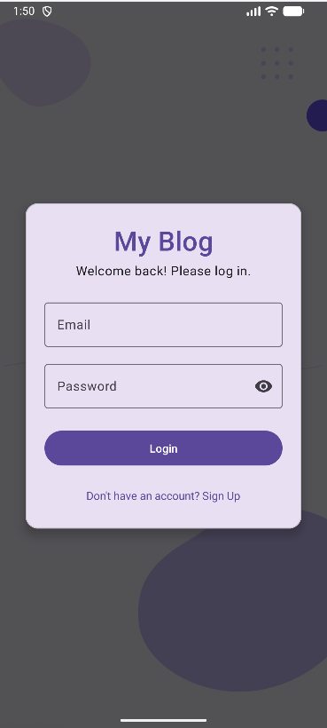
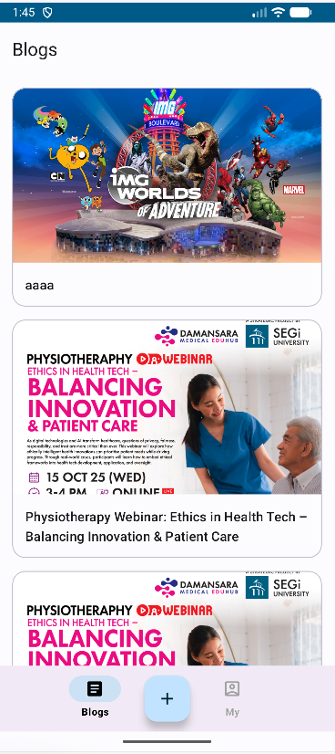
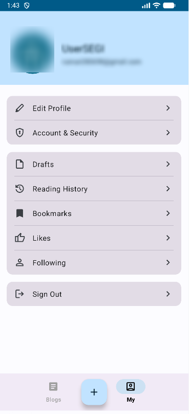
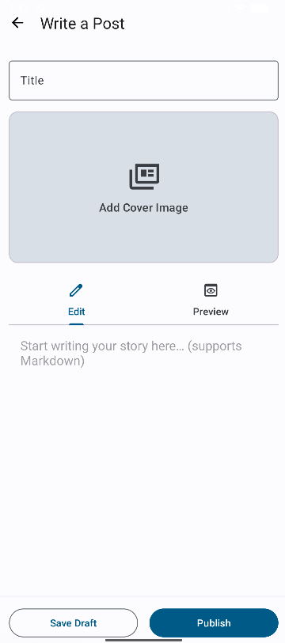
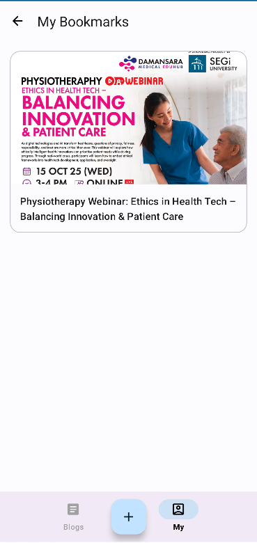
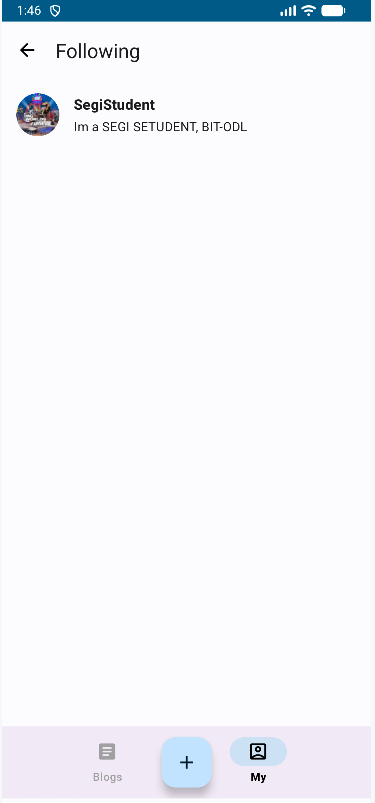

# MyBlog — A Native Android Blog Application

A feature-rich native Android blog client offering a smooth experience for **writing**, **reading**, and **social interaction**. Built with a modern Android architecture (**MVVM**) and **Firebase** backend services.

  
  

---

## ✨ Key Features

### Blog Browsing & Creation

* **Global Feed**: Discover and read public posts from all users in the main feed.
* **Markdown Support**: Compose and publish posts using Markdown (rich text, code blocks, images).
* **Drafts**: Save unfinished posts as drafts and continue editing later.

### User Authentication & Profile

* **Secure Auth**: Reliable email/password registration and login powered by Firebase Auth.
* **User Profile**: View and edit avatar, display name, and bio.

### Personalized “My” Page

* **Reading History**: Automatically records and displays posts the user has viewed.
* **Bookmarks**: Manually save favorite posts for later reading.
* **Following List**: See all authors you follow.
* **Likes**: Centralized place for posts you liked.

### Social Interaction

* **Follow/Unfollow** favorite authors.
* **Like** posts you enjoy.

### Elegant UI/UX

* **Material Design 3** for a modern, consistent look.
* Smooth bottom-navigation experience.
* Friendly loading, empty, and error states.

---

## 🧱 Tech Stack & Architecture

**Architecture**

* **MVVM (Model–View–ViewModel)**: Clear separation of UI and business logic.
* **Single-Activity, Multi-Fragment** using Android Navigation Component.

**UI**

* **Material Design 3**
* **ViewBinding**
* **RecyclerView**
* **Glide** for image loading
* **Markwon** for Markdown rendering

**Backend (Firebase)**

* **Realtime Database** (core data store & sync)
* **Authentication** (email/password)
* **Storage** (user-uploaded media)

**Async & Reactivity**

* **LiveData** (View ↔ ViewModel communication)
* Firebase SDK async APIs (non-blocking UI thread)

---

## 🧩 Build Environment & Base Config (Version-pinned)

### Required Environment (Matches this project)

| Component                       | Value                              |
| ------------------------------- | ---------------------------------- |
| **JDK**                         | **21**                             |
| **Android Gradle Plugin (AGP)** | **8.13.0**                         |
| **Gradle Wrapper**              | **8.7+**                           |
| **Android Studio**              | Latest stable                      |
| **compileSdk**                  | **36**                             |
| **targetSdk**                   | **36**                             |
| **minSdk**                      | **30**                             |
| **Language**                    | Java (MVVM with AndroidX/LiveData) |

> Recommended combo: **JDK 21 + Gradle 8.7+ + AGP 8.13.0**.

### Project settings (`settings.gradle`)

```gradle
pluginManagement {
  repositories { gradlePluginPortal(); google(); mavenCentral() }
}
dependencyResolutionManagement {
  repositoriesMode.set(RepositoriesMode.FAIL_ON_PROJECT_REPOS)
  repositories { google(); mavenCentral() }
}
rootProject.name = "MyBlog"
include(":app")
```

### Project properties (`gradle.properties`)

```properties
org.gradle.jvmargs=-Xmx2048m -Dfile.encoding=UTF-8
android.useAndroidX=true
android.nonTransitiveRClass=true
# org.gradle.parallel=true   # optional
```

### App module (`app/build.gradle`) — Version Catalog aligned

```gradle
plugins {
    alias(libs.plugins.android.application)   // AGP 8.13.0
    id 'com.google.gms.google-services'
}

android {
    namespace 'com.segi.student.blog'
    compileSdk 36

    defaultConfig {
        applicationId "com.segi.student.blog"
        minSdk 30
        targetSdk 36
        versionCode 1
        versionName "1.0"
        testInstrumentationRunner "androidx.test.runner.AndroidJUnitRunner"
    }

    buildTypes {
        release {
            minifyEnabled false
            proguardFiles getDefaultProguardFile('proguard-android-optimize.txt'),
                          'proguard-rules.pro'
        }
    }

    // Java 21 toolchain
    compileOptions {
        sourceCompatibility JavaVersion.VERSION_21
        targetCompatibility JavaVersion.VERSION_21
    }

    buildFeatures { viewBinding true }
}

dependencies {
    // Firebase (BoM controls versions)
    implementation platform(libs.firebase.bom)      // e.g., 34.3.0
    implementation(libs.firebase.analytics)
    implementation(libs.firebase.database)
    implementation(libs.firebase.storage)
    implementation(libs.firebase.auth)

    // AndroidX / Material
    implementation(libs.core)
    implementation(libs.appcompat)                  // e.g., 1.7.1
    implementation(libs.material)                   // e.g., 1.13.0
    implementation(libs.constraintlayout)           // e.g., 2.2.1
    implementation(libs.swiperefreshlayout)         // e.g., 1.1.0
    implementation(libs.navigation.fragment)        // e.g., 2.9.5
    implementation(libs.navigation.ui)              // e.g., 2.9.5

    // Lifecycle (if you’ll stay 100% Java, you can swap to non-ktx variants)
    implementation(libs.lifecycle.livedata.ktx)     // e.g., 2.9.4
    implementation(libs.lifecycle.viewmodel.ktx)    // e.g., 2.9.4

    // Images
    implementation(libs.glide)                      // e.g., 5.0.5
    annotationProcessor(libs.compiler)

    // Tests
    testImplementation(libs.junit)
    androidTestImplementation(libs.ext.junit)
    androidTestImplementation(libs.espresso.core)
}
```

**Notes**

* Avoid dependency duplication: if your catalog defines both `libs.firebase.auth` and `libs.google.firebase.auth`, keep **one** (prefer the BoM-managed `libs.firebase.auth`).
* Keeping `-ktx` artifacts is fine even in a Java app if you might add Kotlin later. If you’ll stay strictly Java, switch to non-ktx to trim transitive deps.
* Ensure `app/google-services.json` is present.

---

## ⚙️ How to Run

1. **Clone**

```bash
git clone https://github.com/truman-ng/MyBlog.git
```

2. **Configure Firebase**

* Create a new Android project in **Firebase Console**.
* Download `google-services.json` from project settings.
* Place it in `app/google-services.json`.
* Enable **Authentication (Email/Password)** and **Realtime Database**.

3. **Build & Run**

* Open with **Android Studio**.
* Wait for Gradle sync.
* Click **Run 'app'** to deploy on an emulator or device.

---

# （中文）MyBlog — 安卓原生博客应用

一个功能丰富的安卓原生博客客户端，专注于**写作**、**阅读**与**社交互动**的流畅体验。项目采用现代化安卓架构（**MVVM**）与 **Firebase** 后端服务。

  
  

---

## ✨ 功能亮点

### 博客浏览与创作

* **全局信息流**：在主信息流发现并阅读所有用户发布的公开博客。
* **Markdown 支持**：使用 Markdown 撰写与发布，支持富文本、代码块与图片。
* **草稿箱**：将未完成文章保存为草稿，随时继续编辑。

### 用户认证与资料

* **安全认证**：基于 Firebase Auth 的邮箱/密码注册登录。
* **个人资料**：查看与编辑头像、昵称与简介。

### 个性化「我的」

* **阅读历史**：自动记录并展示用户浏览过的文章。
* **书签**：手动收藏喜欢的文章，便于回看。
* **关注列表**：查看已关注的博主。
* **点赞汇总**：集中管理所有点赞过的文章。

### 社交互动

* **关注/取关**喜欢的博主。
* **点赞**认可的文章。

### 优雅 UI/UX

* **Material Design 3** 设计语言。
* 流畅的底部导航与切换体验。
* 友好的加载、空状态与错误提示。

---

## 🧱 技术栈与架构

**架构**

* **MVVM**：清晰分离 UI 与业务逻辑。
* **单 Activity、多 Fragment**：使用导航组件管理页面跳转。

**UI**

* **Material Design 3**
* **ViewBinding**
* **RecyclerView**
* **Glide**（图片加载）
* **Markwon**（Markdown 渲染）

**后端（Firebase）**

* **Realtime Database**（数据存储与同步）
* **Authentication**（邮箱/密码）
* **Storage**（用户上传媒体）

**异步与响应式**

* **LiveData**（View 与 ViewModel 通信）
* Firebase SDK 异步 API（避免阻塞 UI 线程）

---

## 🧩 构建环境与基础配置（已固定版本）

### 基础环境（与项目一致）

| 组件                              | 数值                             |
| ------------------------------- | ------------------------------ |
| **JDK**                         | **21**                         |
| **Android Gradle Plugin (AGP)** | **8.13.0**                     |
| **Gradle Wrapper**              | **8.7+**                       |
| **Android Studio**              | 稳定版                            |
| **compileSdk**                  | **36**                         |
| **targetSdk**                   | **36**                         |
| **minSdk**                      | **30**                         |
| **语言**                          | Java（MVVM + AndroidX/LiveData） |

> 推荐组合：**JDK 21 + Gradle 8.7+ + AGP 8.13.0**。

### 工程配置（`settings.gradle`）

```gradle
pluginManagement {
  repositories { gradlePluginPortal(); google(); mavenCentral() }
}
dependencyResolutionManagement {
  repositoriesMode.set(RepositoriesMode.FAIL_ON_PROJECT_REPOS)
  repositories { google(); mavenCentral() }
}
rootProject.name = "MyBlog"
include(":app")
```

### 项目属性（`gradle.properties`）

```properties
org.gradle.jvmargs=-Xmx2048m -Dfile.encoding=UTF-8
android.useAndroidX=true
android.nonTransitiveRClass=true
# org.gradle.parallel=true   # 可选
```

### 模块配置（`app/build.gradle`）— 对齐你的 Version Catalog

```gradle
plugins {
    alias(libs.plugins.android.application)   // AGP 8.13.0
    id 'com.google.gms.google-services'
}

android {
    namespace 'com.segi.student.blog'
    compileSdk 36

    defaultConfig {
        applicationId "com.segi.student.blog"
        minSdk 30
        targetSdk 36
        versionCode 1
        versionName "1.0"
        testInstrumentationRunner "androidx.test.runner.AndroidJUnitRunner"
    }

    buildTypes {
        release {
            minifyEnabled false
            proguardFiles getDefaultProguardFile('proguard-android-optimize.txt'),
                          'proguard-rules.pro'
        }
    }

    // Java 21
    compileOptions {
        sourceCompatibility JavaVersion.VERSION_21
        targetCompatibility JavaVersion.VERSION_21
    }

    buildFeatures { viewBinding true }
}

dependencies {
    implementation platform(libs.firebase.bom)
    implementation(libs.firebase.analytics)
    implementation(libs.firebase.database)
    implementation(libs.firebase.storage)
    implementation(libs.firebase.auth)

    implementation(libs.core)
    implementation(libs.appcompat)
    implementation(libs.material)
    implementation(libs.constraintlayout)
    implementation(libs.swiperefreshlayout)
    implementation(libs.navigation.fragment)
    implementation(libs.navigation.ui)

    implementation(libs.lifecycle.livedata.ktx)
    implementation(libs.lifecycle.viewmodel.ktx)

    implementation(libs.glide)
    annotationProcessor(libs.compiler)

    testImplementation(libs.junit)
    androidTestImplementation(libs.ext.junit)
    androidTestImplementation(libs.espresso.core)
}
```

**说明**

* 避免重复依赖：如果 Catalog 同时定义了 `libs.firebase.auth` 和 `libs.google.firebase.auth`，请**只保留一个**（推荐使用 BoM 管理的 `libs.firebase.auth`）。
* 如果后续不会引入 Kotlin，可将 `-ktx` 依赖替换为非 ktx 版本，精简体积；如果可能加入 Kotlin，则保留即可。
* 确保 `app/google-services.json` 已放置。

---

## ⚙️ 如何运行

1）**克隆项目**

```bash
git clone https://github.com/truman-ng/MyBlog.git
```

2）**配置 Firebase**

* 在 **Firebase 控制台** 新建 Android 项目。
* 下载 `google-services.json` 并放在 `app/google-services.json`。
* 启用 **Authentication（邮箱/密码）** 与 **Realtime Database**。

3）**构建与运行**

* 用 **Android Studio** 打开项目。
* 等待 Gradle 同步完成。
* 点击 **Run 'app'** 在模拟器或真机运行。
